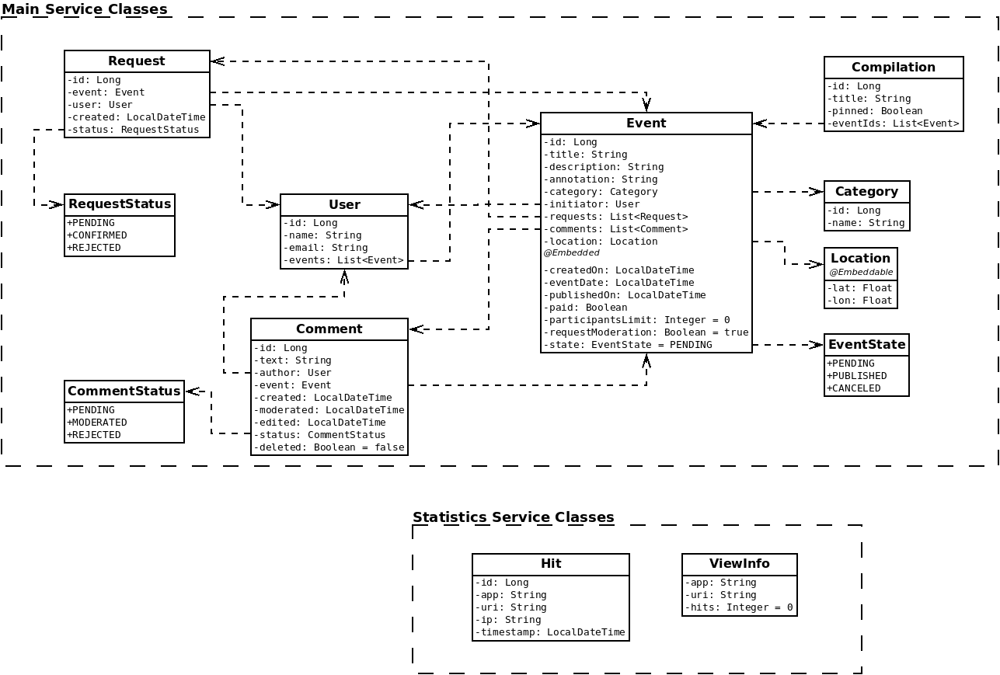
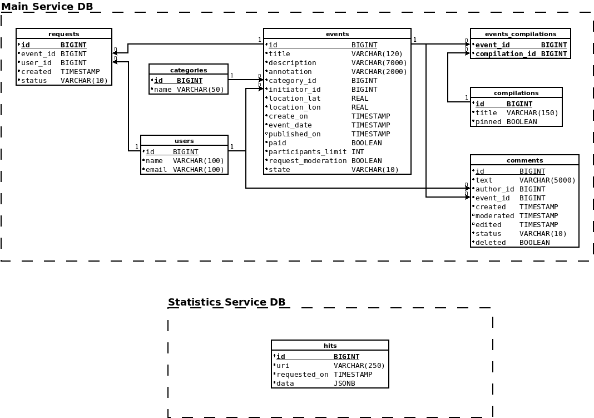
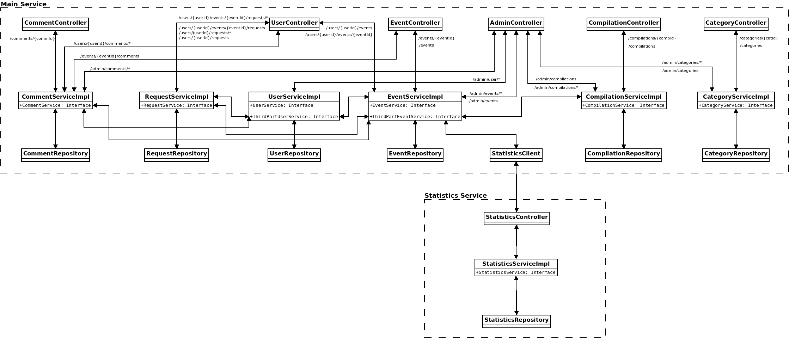

# Проект ExploreWithMe
[Ссылка на pull request](https://github.com/pavalka/explore-with-me/pull/2)

Данный репозиторий содержит учебный проект ExplorerWithMe, который представляет собой бекэнд сервиса, позволяющего 
пользователям делиться информацией об интересных событиях и искать компанию для участия в них.
Ниже кратко описывается структура данного приложения:
- структура сущностей
- структура базы данных
- структура приложения (схема взаимодействия сервисов, контроллеров, репозиториев и т. д.)

Приложение состоит из двух сервисов: основного сервиса (main service) и сервиса статистики (statistics service). Исходя 
из этого, каждая схема разбита на две части, которые описывают соответствующие сервисы.

## Структура приложения
### Структура сущностей
На рисунке ниже приведены классы, которые описывают модель данных данного приложения. Стрелками отображены зависимости 
классов друг от друга.

В секции **Main service classes** находятся классы, относящиеся к главному сервису приложения, а в секции **Statistics
service classes** - к сервису статистики.

### Структура БД
На рисунке ниже приведена ER-диаграмма БД приложения.

Здесь так же, как и в предыдущем разделе таблицы разбиты на две части:
1. **Main service DB** - таблицы БД основного сервиса.
   
   - `requests` - таблица, которая хранит запросы пользователей на участие в различных событиях;
   - `categories` - таблица, которая хранит категории событий;
   - `users` - таблица, которая хранит информацию о пользователях сервиса;
   - `events` - таблица, хранящая данных о событиях;
   - `compilations` - таблица, которая хранит информацию о подборках событий;
   - `events_compilations` - таблица, которая задает связь между событиями и подборками событий;
   - `comments` - таблица, хранящая комментарии пользователей;

2. **Statistics service DB** - таблица базы данных сервиса статистики.

### Структура приложения
Структура приложения представлена на рисунке ниже.

Здесь стоит отметить, что классы бизнес-логики `XxxServiceImpl` могут реализовывать два интерфейса: `XxxService` и 
`ThirdPartXxxService`. Здесь `Xxx` обозначает сущность, за логику работы с которой, отвечает данный класс. Например, 
за логику обработки сущности `User` отвечает класс `UserServiceImpl`. 
Интерфейс `XxxService` описывает функционал, предоставляемый классом `XxxServiceImpl` REST-контроллерам приложения. А 
интерфейс `ThirdPartXxxService`, в свою очередь, описывает функционал, предоставляемый другим классам `XxxServiceImpl`.
Например, как показано на схеме выше, класс `UserServiceImpl` предоставляет свой функционал классам `EventServiceImpl`, 
`RequestServiceImpl` и `CommentServiceImpl`.
Взаимодействие основного сервиса с сервисом статистики осуществляется через `StatisticsClient`.
